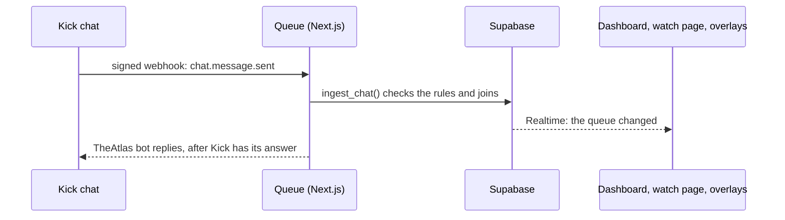

<div align="center">

<picture>
  <source media="(prefers-color-scheme: dark)" srcset="public/TheAtlasQueueB2048.png">
  
</picture>

<br>

**The viewer queue for Kick streams.**<br>
Chat joins, you draw the teams, Victory keeps the score, and everyone watches it happen.

[Open Queue](https://theatlas-queue.vercel.app) &nbsp;&nbsp; [Wiki](https://theatlas-queue.vercel.app/wiki) &nbsp;&nbsp; [Türkçe](README.tr.md)

</div>

<br>

```text
  mavi_yaka        !sıra Mavi#TR1
  🤖 TheAtlas      @mavi_yaka joined the queue at #7.
  gececi           !sıram
  🤖 TheAtlas      @gececi, you're #3 in the queue.
  mavi_yaka        !sıra
  🤖 TheAtlas      @mavi_yaka, you're already in the queue.
```

That is the whole viewer side. There's no sign-up and no link to click. A viewer types one word in Kick chat, and in that moment they're in the queue on your dashboard, your public watch page and your stream overlay.

## A night with Queue

1. **Go live.** Queue is already listening to your Kick chat.
2. **Chat joins.** `!sıra` puts a viewer at the end of the queue. `!sıra Name#TAG` also adds their Riot ID, so you see their solo queue rank.
3. **Draw teams.** Press **Draw teams** (or `D`), and both teams fill from the waiting players. Fair play can put people who haven't played yet first, and it mixes teammates from game to game.
4. **Play.** Reroll, pick single players, move people between teams. Every change can be undone.
5. **Victory.** One press records the winner, updates the score and streaks, and does whatever you chose for next: a new draw, a shuffle, or everyone back in the queue.
6. **Everyone follows.** Your watch page and OBS overlays update live and play the draw reveal on stream.

## What's in it

**For the streamer**

- A dashboard made to sit beside a game for four hours. It has two warm, low-glare themes, *Mürekkep* (dark) and *Kâğıt* (light), a command palette, and keyboard shortcuts for everything that matters.
- Joining rules: open or closed, a queue limit, subscribers only, a required Riot ID, and sitting out after a game.
- Teams of 1 to 5 players, and five ways to reveal a pick: typed names, cards, a list, a wheel, or the result at once.
- Games and stats: wins, losses, streaks, most wins and most respected, kept for as long as you choose.
- Your own wording for the team names, the titles and the six chat commands, in English and Turkish.
- Chat replies from Kick's bot, in your stream's language, turned on with one switch. Answers are gathered for a few seconds and sent together, so a rush of joins doesn't flood your chat.
- **Delete my data** in Settings removes your channel and everything in it.

**For moderators**

- Kick moderators get access on their own: their first chat message with the moderator badge lets them in, and they sign in with their own Kick account.
- Warn, punish and ban. Respect is counted per viewer, and History shows who did what.

**For viewers**

- Six chat commands: join, leave, position, away, protected picks left, and `!izle` for the watch page link. `!komutlar` lists them.
- A public watch page for phones that shows the teams, the queue, the games and the management feed, live.
- The subscriber perk protects a drawn subscriber from a reroll, a set number of times.

The [Wiki](https://theatlas-queue.vercel.app/wiki) covers every screen, command and setting, in both languages.

## How it works



- **Kick webhooks, not a socket.** Kick signs every chat event and posts it to `/api/kick/webhook`. Queue checks the signature and answers straight away, and sends its chat reply after that, so a slow reply never holds up a join.
- **The rules live in Postgres.** Joining, drawing, Victory, moderation and Undo are SQL functions behind row-level security. The dashboard, moderators and chat all go through them, so they can't disagree.
- **Everything is live.** Every screen subscribes to the channel it shows, so the overlay always matches what the streamer sees.
- **Secrets stay on the server.** A streamer's Kick token for chat replies is only kept while replies are on. It's encrypted with AES-256-GCM, and revoked as soon as replies are turned off.

| Layer | Built with |
| --- | --- |
| App | Next.js 16 (App Router), React 19, TypeScript 6 |
| Interface | shadcn/ui on Radix, Tailwind CSS 4, Newsreader and Hanken Grotesk |
| Sign-in | Auth.js 5 with Kick OAuth |
| Data | Supabase: Postgres, row-level security, Realtime, pg_cron |
| Runtime | Bun |

## Run your own

You need [Bun](https://bun.sh), a [Supabase](https://supabase.com) project, a Kick developer app, and a public HTTPS address that Kick can send webhooks to (a Vercel deploy works).

**1. Install**

```bash
git clone https://github.com/atlasatakahraman/TheAtlas-Queue.git
cd TheAtlas-Queue
bun install
```

**2. Supabase.** Apply the files in `supabase/migrations/` in order, from `0000` up. Then make a signing key for Queue's database sessions:

```bash
bun --bun scripts/gen-signing-key.ts
```

Import the key it prints in Supabase under *JWT Keys*.

**3. Kick.** In your Kick developer settings, create an app with:

- the redirect URL `https://<your-host>/api/auth/callback/kick`
- the scopes `user:read`, `chat:write` and `events:subscribe`
- webhooks turned on and pointed at `https://<your-host>/api/kick/webhook`

**4. Environment.** Put these in `.env.local`, and in your host's settings:

| Variable | What it is |
| --- | --- |
| `AUTH_SECRET` | The Auth.js secret: `openssl rand -base64 32` |
| `AUTH_URL` | Your address, for example `http://localhost:3000` |
| `KICK_CLIENT_ID`, `KICK_CLIENT_SECRET` | From your Kick app |
| `NEXT_PUBLIC_SUPABASE_URL` | Your Supabase project URL |
| `NEXT_PUBLIC_SUPABASE_PUBLISHABLE_KEY` | The Supabase publishable key |
| `SUPABASE_SECRET_KEY` | The Supabase secret key (server only) |
| `SUPABASE_JWT_PRIVATE_JWK` | The key printed in step 2 |
| `KICK_TOKEN_KEY` | 32 random bytes as base64: `openssl rand -base64 32` |
| `RIOT_API_KEY` | A Riot developer key, for ranks |

**5. Run**

```bash
bun --bun run next:dev
```

Open `http://localhost:3000` and sign in with Kick. Welcome connects your chat in three steps.

Before you deploy, `bun --bun run check:types`, `check:lint` and `next:build` must all pass. The build also checks its output for leaked secrets.

## Licence

[AGPL-3.0-or-later](LICENSE). You can run, change and share Queue. If you run a changed version for other people over a network, you must offer them its source code too.

<br>

<div align="center">
<sub>Made by <a href="https://github.com/atlasatakahraman">atlasatakahraman</a> for the streams it runs on.</sub>
</div>
