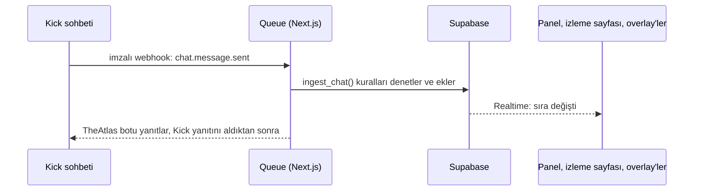

<div align="center">

<picture>
  <source media="(prefers-color-scheme: dark)" srcset="public/TheAtlasQueueB2048.png">
  
</picture>

<br>

**Kick yayınları için izleyici sırası.**<br>
Sohbet katılır, takımları sen çekersin, Kazandı skoru tutar, herkes canlı izler.

[Queue'yu aç](https://theatlas-queue.vercel.app/?lang=tr) &nbsp;&nbsp; [Wiki](https://theatlas-queue.vercel.app/wiki?lang=tr) &nbsp;&nbsp; [English](README.md)

</div>

<br>

```text
  mavi_yaka        !sıra Mavi#TR1
  🤖 TheAtlas      @mavi_yaka sıraya katıldı, sıran #7.
  gececi           !sıram
  🤖 TheAtlas      @gececi, sıradaki yerin #3.
  mavi_yaka        !sıra
  🤖 TheAtlas      @mavi_yaka, zaten sıradasın.
```

İzleyicinin yapacağı her şey bu kadar. Kayıt yok, tıklanacak bağlantı yok. İzleyici Kick sohbetine tek kelime yazar ve o an senin panelinde, herkese açık izleme sayfanda ve yayın overlay'inde sıradadır.

## Queue ile bir yayın gecesi

1. **Yayını aç.** Queue, Kick sohbetini zaten dinliyor.
2. **Sohbet katılır.** `!sıra` izleyiciyi sıranın sonuna ekler. `!sıra İsim#TAG` Riot ID'sini de ekler, böylece solo queue rankını görürsün.
3. **Takımları çek.** **Takımları çek**'e (ya da `D`'ye) bas, iki takım bekleyen oyunculardan dolar. Adil oyun, henüz oynamamış olanları öne alabilir ve takım arkadaşlarını maçtan maça karıştırır.
4. **Oyna.** Yeniden çek, tek tek oyuncu seç, takımlar arasında taşı. Her değişiklik geri alınabilir.
5. **Kazandı.** Tek basış kazananı kaydeder, skoru ve serileri günceller, sonra ne seçtiysen onu yapar: yeni kura, karıştırma ya da herkes sıraya geri.
6. **Herkes takip eder.** İzleme sayfan ve OBS overlay'lerin canlı güncellenir ve kura animasyonunu yayında oynatır.

## İçinde neler var

**Yayıncı için**

- Bir oyunun yanında dört saat açık kalmak için yapılmış bir panel. Göz yormayan iki sıcak tema, *Mürekkep* (koyu) ve *Kâğıt* (açık), bir komut paleti ve önemli her şey için klavye kısayolları var.
- Katılım kuralları: açık ya da kapalı, sıra sınırı, yalnızca aboneler, zorunlu Riot ID ve maçtan sonra bekleme.
- 1 ile 5 kişilik takımlar ve bir seçimi göstermenin beş yolu: yazılan isimler, kartlar, liste, çark ya da sonuç hemen.
- Maçlar ve istatistikler: galibiyet, mağlubiyet, seriler, en çok kazanan ve en saygılı, istediğin süre boyunca saklanır.
- Takım adları, başlıklar ve altı sohbet komutu için kendi kelimelerin, Türkçe ve İngilizce.
- Kick botundan, yayınının dilinde sohbet yanıtları, tek bir anahtarla açılır. Yanıtlar birkaç saniye toplanıp birlikte gider, böylece katılım yağmuru sohbeti doldurmaz.
- Ayarlar'daki **Verilerimi sil** kanalını ve içindeki her şeyi siler.

**Moderatörler için**

- Kick moderatörleri erişimi kendiliğinden alır: moderatör rozetli ilk sohbet mesajları onları içeri alır ve kendi Kick hesaplarıyla giriş yaparlar.
- Uyar, cezalandır, banla. Saygı her izleyici için sayılır, Geçmiş kimin ne yaptığını gösterir.

**İzleyiciler için**

- Altı sohbet komutu: katıl, ayrıl, sıram, uzakta, kalan korumalı hak ve izleme sayfası bağlantısı için `!izle`. `!komutlar` hepsini sıralar.
- Telefonlar için herkese açık bir izleme sayfası: takımlar, sıra, maçlar ve yönetim akışı, canlı.
- Abone ayrıcalığı, çekilen bir aboneyi belirli sayıda yeniden çekmeye karşı korur.

[Wiki](https://theatlas-queue.vercel.app/wiki?lang=tr) her ekranı, komutu ve ayarı iki dilde anlatır.

## Nasıl çalışır



- **Soket değil, Kick webhook'ları.** Kick her sohbet olayını imzalar ve `/api/kick/webhook`'a gönderir. Queue imzayı denetler ve hemen yanıt verir, sohbet yanıtını ondan sonra gönderir; yavaş bir yanıt hiçbir katılımı bekletmez.
- **Kurallar Postgres'te.** Katılma, kura, Kazandı, moderasyon ve Geri al, satır düzeyi güvenliğin arkasındaki SQL fonksiyonlarıdır. Panel, moderatörler ve sohbet hep bunlardan geçer, bu yüzden birbirleriyle çelişemezler.
- **Her şey canlı.** Her ekran gösterdiği kanala abone olur, overlay her zaman yayıncının gördüğüyle aynıdır.
- **Sırlar sunucuda kalır.** Yayıncının sohbet yanıtları için Kick anahtarı yalnızca yanıtlar açıkken tutulur. AES-256-GCM ile şifrelenir ve yanıtlar kapanınca hemen iptal edilir.

| Katman | Kullanılan |
| --- | --- |
| Uygulama | Next.js 16 (App Router), React 19, TypeScript 6 |
| Arayüz | Radix üstünde shadcn/ui, Tailwind CSS 4, Newsreader ve Hanken Grotesk |
| Giriş | Kick OAuth ile Auth.js 5 |
| Veri | Supabase: Postgres, satır düzeyi güvenlik, Realtime, pg_cron |
| Çalışma ortamı | Bun |

## Kendin çalıştır

[Bun](https://bun.sh), bir [Supabase](https://supabase.com) projesi, bir Kick geliştirici uygulaması ve Kick'in webhook gönderebileceği herkese açık bir HTTPS adresi gerekir (bir Vercel dağıtımı iş görür).

**1. Kur**

```bash
git clone https://github.com/atlasatakahraman/TheAtlas-Queue.git
cd TheAtlas-Queue
bun install
```

**2. Supabase.** `supabase/migrations/` içindeki dosyaları `0000`'dan başlayarak sırayla uygula. Sonra Queue'nun veritabanı oturumları için bir imza anahtarı oluştur:

```bash
bun --bun scripts/gen-signing-key.ts
```

Yazdırdığı anahtarı Supabase'de *JWT Keys* altında içe aktar.

**3. Kick.** Kick geliştirici ayarlarında şu özelliklerle bir uygulama oluştur:

- yönlendirme adresi `https://<adresin>/api/auth/callback/kick`
- `user:read`, `chat:write` ve `events:subscribe` izinleri
- webhook'lar açık ve `https://<adresin>/api/kick/webhook` adresine yönlendirilmiş

**4. Ortam.** Bunları `.env.local` dosyasına ve barındırma ayarlarına koy:

| Değişken | Nedir |
| --- | --- |
| `AUTH_SECRET` | Auth.js gizli anahtarı: `openssl rand -base64 32` |
| `AUTH_URL` | Adresin, örneğin `http://localhost:3000` |
| `KICK_CLIENT_ID`, `KICK_CLIENT_SECRET` | Kick uygulamandan |
| `NEXT_PUBLIC_SUPABASE_URL` | Supabase proje adresin |
| `NEXT_PUBLIC_SUPABASE_PUBLISHABLE_KEY` | Supabase publishable anahtarı |
| `SUPABASE_SECRET_KEY` | Supabase gizli anahtarı (yalnızca sunucu) |
| `SUPABASE_JWT_PRIVATE_JWK` | 2. adımda yazdırılan anahtar |
| `KICK_TOKEN_KEY` | base64 olarak 32 rastgele bayt: `openssl rand -base64 32` |
| `RIOT_API_KEY` | Ranklar için bir Riot geliştirici anahtarı |

**5. Çalıştır**

```bash
bun --bun run next:dev
```

`http://localhost:3000` adresini aç ve Kick ile giriş yap. Hoş geldin ekranı sohbetini üç adımda bağlar.

Dağıtmadan önce `bun --bun run check:types`, `check:lint` ve `next:build` geçmeli. Derleme, çıktısında sızmış sır olup olmadığını da denetler.

## Lisans

[AGPL-3.0-or-later](LICENSE). Queue'yu çalıştırabilir, değiştirebilir ve paylaşabilirsin. Değiştirdiğin bir sürümü ağ üzerinden başkalarına sunuyorsan, kaynak kodunu da onlara sunmalısın.

<br>

<div align="center">
<sub><a href="https://github.com/atlasatakahraman">atlasatakahraman</a> tarafından, üzerinde çalıştığı yayınlar için yapıldı.</sub>
</div>
